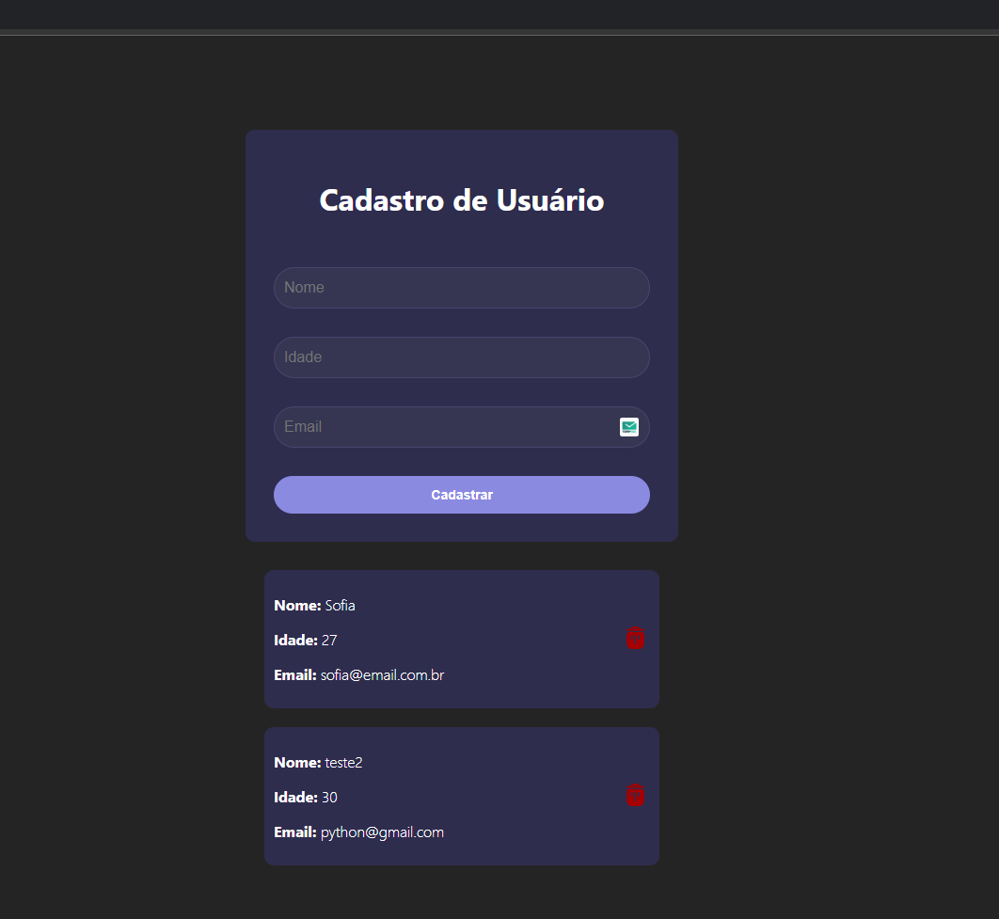

# Cadastro de Usuarios

Esse projeto visa criar uma API usando *NodeJs* e a biblioteca *Express* para cadastro de Usuarios e comunicação com Banco de Dados. \
E a criação de uma pagina para o FrontEnd utilizando *ReactJs* com intuito de consumir essa API

## Tecnologias Usadas

* NodeJs (express)
* JavaScript
* React

## Database

* MongoDB 

## API EndPoints 

>- GET /users - Retorna os usuarios cadastrados 
>
>- GET /users/parametro - Retorna os usuarios cadastrados de acordo com esse parametro
>
>- POST /users - Cadastra o usuario 
>
>- PUT /users/:id - Modifica o cadastro do usuario com o Id informado 
>
>- DELETE /users/:id - Deleta o usuario com o Id informado 
>
>

## Imagem do projeto

  

